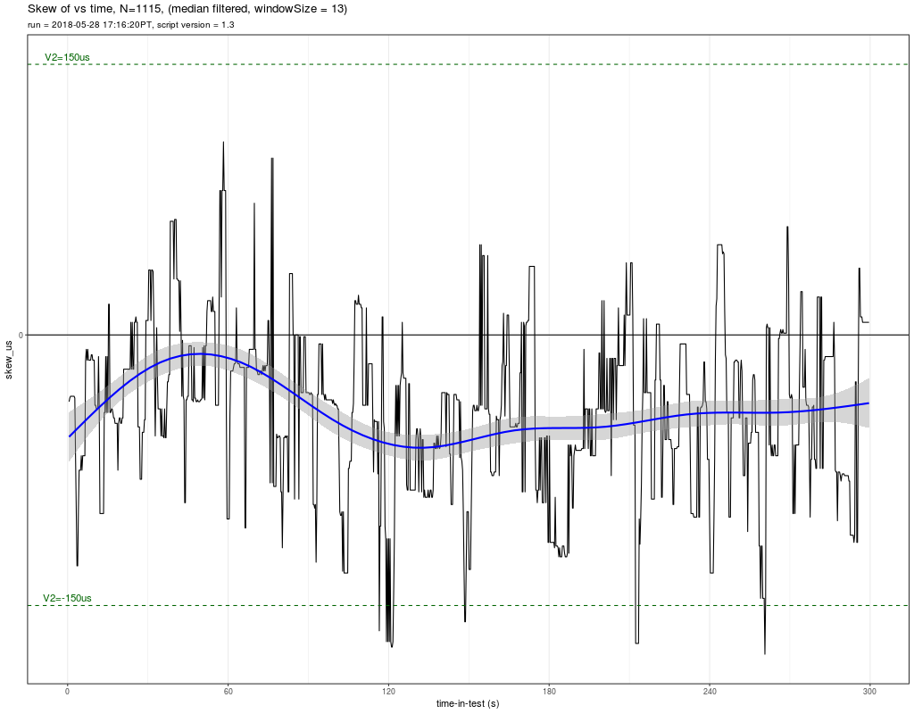
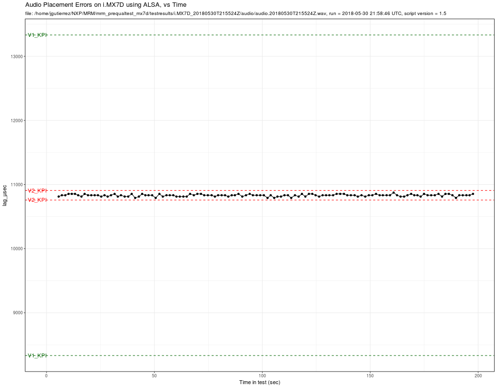

# MRM PreQual Test for i.MX7D

Test results for the MRM Pre Qualification Test for i.MX7D

---

## TEST 1: AUDIO PIPELINE DRIFT

### Results

Observing a 1 cycle of the sine wave we can see there is exactly 100 samples per period

However in a more significant t = 5s, the drifting is now visible.

Doing the calculations with: S1=0, S2=479993, T1=0s, T2=9.99985s

    wavFileFrequency = 480
    sampleRate = 48000
    samplesPerPeriod = sampleRate / wavFileFrequency = 100
    error_samples = (479993 - 0) – 100 * round((479993 - 0)/100) = 7
    deltaT = T2-T1 = 9.99985 - 0 = 9.99985
    error_PPM = 1.0E6 * (7 / 48000) / 9.99985 = 14.58

**ERROR PPM** = **MISSING** which is < 20 PPM, so

**TEST is PASSED**

---

## TEST 2: HIGH-RESOLUTION TIMER

### Results

**Test PASSED** from observing console output

### Sample Output Evidence

    root@imx8mqevk:~/mrm_prequaltest# ./preQualTest --gtest_filter="HRT.*"
    sh: line 0: echo: write error: Device or resource busy
    PreQualification for device: 'Freescale i.MX8MQ EVK', IPaddr: 192.168.1.111, run: 2018-06-07T19:26:28Z

    Note: Google Test filter = HRT.*
    [==========] Running 2 tests from 1 test case.
    [----------] Global test environment set-up.
    [----------] 2 tests from HRT
    [ RUN      ] HRT.SlowAccessTest
    Ensures that HRT increments at about the right rate (~1E9 ns/sec)

    HRT1_ns,HRT2_ns,delta_ns,result
    288824369964,289824443284,1000073320,PASS
    289824476524,290824554284,1000077760,PASS
    290824584044,291824657604,1000073560,PASS
    291824687604,292824767165,1000079561,PASS
    292824800645,293824867965,1000067320,PASS
    293824901805,294824972365,1000070560,PASS
    294825002125,295825072565,1000070440,PASS
    295825104245,296825172166,1000067921,PASS
    296825204206,297825271766,1000067560,PASS
    297825302006,298825428006,1000126000,PASS
    298825460046,299825593246,1000133200,PASS
    299825624926,300825695607,1000070681,PASS
    300825725487,301825793047,1000067560,PASS
    301825824847,302825902007,1000077160,PASS
    302825934407,303826004607,1000070200,PASS
    303826036647,304826113807,1000077160,PASS
    304826145727,305826213048,1000067321,PASS
    305826247008,306826323448,1000076440,PASS
    306826353448,307826479808,1000126360,PASS
    307826511368,308826644808,1000133440,PASS
    308826674928,309826742609,1000067681,PASS
    309826772609,310826844609,1000072000,PASS
    310826877849,311826954649,1000076800,PASS
    311826984529,312827061569,1000077040,PASS
    312827091329,313827158530,1000067201,PASS
    [       OK ] HRT.SlowAccessTest (25003 ms)
    [ RUN      ] HRT.FastAccessTest
    Ensures that the HRT can be accessed quickly (<=3us, 1 failure allowed)

    HRT1_ns,HRT2_ns,delta_ns,result
    313827290890,313827291010,120,PASS
    313827301690,313827301810,120,PASS
    313827309730,313827309850,120,PASS
    313827319570,313827319690,120,PASS
    313827329410,313827329530,120,PASS
    313827337330,313827337450,120,PASS
    313827347050,313827347170,120,PASS
    313827355090,313827355210,120,PASS
    313827364810,313827364930,120,PASS
    313827372730,313827372850,120,PASS
    313827382570,313827382690,120,PASS
    313827390970,313827391090,120,PASS
    313827398890,313827399010,120,PASS
    313827408610,313827408730,120,PASS
    313827416770,313827416890,120,PASS
    313827426850,313827426970,120,PASS
    313827434770,313827434890,120,PASS
    313827444730,313827444850,120,PASS
    313827452770,313827452890,120,PASS
    313827462970,313827462970,0,PASS
    313827473050,313827473170,120,PASS
    313827480970,313827481090,120,PASS
    313827491050,313827491170,120,PASS
    313827498970,313827499090,120,PASS
    313827508930,313827509050,120,PASS
    [       OK ] HRT.FastAccessTest (0 ms)
    [----------] 2 tests from HRT (25003 ms total)

    [----------] Global test environment tear-down
    [==========] 2 tests from 1 test case ran. (25003 ms total)
    [  PASSED  ] 2 tests.
    root@imx8mqevk:~/mrm_prequaltest#

---

## TEST 3: GPIO VALIDATION

### Results

**Test PASSED** by observing Logic Analyzers graphics the width of slow pulses are = 1s, while small pulses are 0.32us (< 1us)

### Sample Output

    root@imx8mqevk:~/mrm_prequaltest# ./preQualTest --gtest_filter="GPIO.*"
    PreQualification for device: 'Freescale i.MX8MQ EVK', IPaddr: 192.168.1.111, run: 2018-04-27T18:56:06Z

    Note: Google Test filter = GPIO.*
    [==========] Running 2 tests from 1 test case.
    [----------] Global test environment set-up.
    [----------] 2 tests from GPIO
    [ RUN      ] GPIO.SlowAccessTest
    Ensures that GPIO can be toggled

    Start recording on the logic analyzer.
    GPIO high
    GPIO low
    GPIO high
    GPIO low
    GPIO high
    GPIO low
    GPIO high
    GPIO low
    GPIO high
    GPIO low
    Stop recording on the logic analyzer.
    [       OK ] GPIO.SlowAccessTest (10006 ms)
    [ RUN      ] GPIO.FastAccessTest
    Ensures that the GPIO can be toggled quickly (<1us)

    Start recording on the logic analyzer.
    GPIO transitioning 20 times.
    Stop recording on the logic analyzer.

    TODO: Manually check the logic analyzer output.
          Slow pulses should have H/L time of ~1s.
          Fast pulses should have H/L time of <1us.
          Duration of fast pulse section should be <20us.
    [       OK ] GPIO.FastAccessTest (0 ms)
    [----------] 2 tests from GPIO (10006 ms total)

    [----------] Global test environment tear-down
    [==========] 2 tests from 1 test case ran. (10007 ms total)
    [  PASSED  ] 2 tests.

---

## TEST4: TIME SYNCHRONIZATION

### Results

**Test PASSED** from graphics obtained from Logic Analyzer([TimeSync3.test.csv](TimeSync_results/TimeSync3.test.csv)) it can be observed that The TP95 is around **90us** of the median (TP50) line.
(Application note marked as PASSED if within 150us)

---

## TEST 5: AUDIO PLACEMENT

### Results Using Alsa Device as HW:2,0

#### Sample Output from RScript results

**Test PASSED** by inspecting [report_i.MX7D.txt](testresults/i.MX7D_20180529T230243Z/report_i.MX7D.txt) file

    +-----------------------------------------------------+
    | AUDIO PLACEMENT FOR i.MX7D                          |
    | run = 2018-05-29 23:06:05 UTC, script version = 1.5 |
    +-----------------------------------------------------+
    N (number of samples) = 98
    
    TP0 (min)    = 11166 µs = TP50 - 21 µs
    TP2.5        = 11166 µs = TP50 - 21 µs
    TP50         = 11187 µs
    TP97.5       = 11229 µs = TP50 + 42 µs
    TP100 (max)  = 11229 µs = TP50 + 42 µs
    
    NOTE: always manually check the audio file, too.
    
    +-------------------------------------+
    | Level 1 KPI compliance (Multi-room) |
    +-------------------------------------+
    KPI1a (TP95 spread  < 5000µs) = 63µs: PASS
    KPI1b (TP100 spread < 5000µs) = 63µs: PASS
         Samples outside V1 TP100 KPI: 0 out of 98 = ~0%
    
    +------------------------------------+
    | Level 2 KPI compliance (LR Stereo) |
    +------------------------------------+
    KPI2a (TP95 spread  < 150µs)= 63µs: PASS
    KPI2b (TP100 spread < 150µs) = 63µs: PASS
         Samples outside V2 TP100 KPI: 0 out of 98 = ~0%
    
    +----------------------+
    | Audio Placement Data |
    +----------------------+
    
    Assume constant (correctable) lag is TP50(lag_µs): 11187 µs
    
            sn burstStartSN lag_µsec uncorrected_lag_µsec V1_KPI V2_KPI
    1   286069       334606    11187                    0      .      .
    2   357246       405782    11166                  -21      .      .
    3   502561       551098    11187                    0      .      .
    4   574213       622751    11208                   21      .      .
    5   643678       692215    11187                    0      .      .
    6   713044       761581    11187                    0      .      .
    7   785604       834140    11166                  -21      .      .
    8   854858       903396    11208                   21      .      .
    9   928081       976618    11187                    0      .      .
    10 1000572      1049109    11187                    0      .      .
    11 1074433      1122971    11208                   21      .      .
    12 1146217      1194755    11208                   21      .      .
    13 1217971      1266508    11187                    0      .      .
    14 1289437      1337974    11187                    0      .      .
    15 1358639      1407176    11187                    0      .      .
    16 1432161      1480699    11208                   21      .      .
    17 1510067      1558604    11187                    0      .      .
    18 1580817      1629354    11187                    0      .      .
    19 1649803      1698340    11187                    0      .      .
    20 1731033      1779570    11187                    0      .      .
    21 1809037      1857575    11208                   21      .      .
    22 1885218      1933755    11187                    0      .      .
    23 1961302      2009840    11208                   21      .      .
    24 2043074      2091612    11208                   21      .      .
    25 2114371      2162908    11187                    0      .      .
    26 2184685      2233222    11187                    0      .      .
    27 2254103      2302641    11208                   21      .      .
    28 2333045      2381582    11187                    0      .      .
    29 2410838      2459375    11187                    0      .      .
    30 2492093      2540632    11229                   42      .      .
    31 2566612      2615149    11187                    0      .      .
    32 2646930      2695467    11187                    0      .      .
    33 2719543      2768080    11187                    0      .      .
    34 2796428      2844967    11229                   42      .      .
    35 2865428      2913966    11208                   21      .      .
    36 2938920      2987458    11208                   21      .      .
    37 3016595      3065132    11187                    0      .      .
    38 3089521      3138057    11166                  -21      .      .
    39 3163707      3212245    11208                   21      .      .
    40 3246034      3294572    11208                   21      .      .
    41 3322915      3371452    11187                    0      .      .
    42 3402399      3450935    11166                  -21      .      .
    43 3473521      3522057    11166                  -21      .      .
    44 3553576      3602112    11166                  -21      .      .
    45 3635957      3684495    11208                   21      .      .
    46 3707724      3756263    11229                   42      .      .
    47 3778342      3826879    11187                    0      .      .
    48 3855679      3904216    11187                    0      .      .
    49 3929576      3978113    11187                    0      .      .
    50 4001040      4049577    11187                    0      .      .
    51 4076609      4125147    11208                   21      .      .
    52 4145583      4194120    11187                    0      .      .
    53 4224200      4272738    11208                   21      .      .
    54 4307047      4355586    11229                   42      .      .
    55 4389162      4437699    11187                    0      .      .
    56 4470496      4519033    11187                    0      .      .
    57 4540641      4589179    11208                   21      .      .
    58 4624073      4672611    11208                   21      .      .
    59 4701388      4749926    11208                   21      .      .
    60 4780742      4829279    11187                    0      .      .
    61 4862004      4910541    11187                    0      .      .
    62 4930819      4979356    11187                    0      .      .
    63 5007515      5056052    11187                    0      .      .
    64 5078396      5126933    11187                    0      .      .
    65 5155571      5204109    11208                   21      .      .
    66 5232684      5281221    11187                    0      .      .
    67 5308482      5357019    11187                    0      .      .
    68 5380345      5428883    11208                   21      .      .
    69 5461831      5510367    11166                  -21      .      .
    70 5543304      5591842    11208                   21      .      .
    71 5614512      5663048    11166                  -21      .      .
    72 5689907      5738445    11208                   21      .      .
    73 5767858      5816395    11187                    0      .      .
    74 5841601      5890137    11166                  -21      .      .
    75 5914056      5962594    11208                   21      .      .
    76 5991437      6039975    11208                   21      .      .
    77 6068362      6116899    11187                    0      .      .
    78 6142820      6191358    11208                   21      .      .
    79 6214559      6263096    11187                    0      .      .
    80 6296826      6345364    11208                   21      .      .
    81 6373743      6422279    11166                  -21      .      .
    82 6452467      6501004    11187                    0      .      .
    83 6535085      6583623    11208                   21      .      .
    84 6607644      6656181    11187                    0      .      .
    85 6686233      6734771    11208                   21      .      .
    86 6838884      6887421    11187                    0      .      .
    87 6919081      6967618    11187                    0      .      .
    88 7000827      7049365    11208                   21      .      .
    89 7080431      7128968    11187                    0      .      .
    90 7157023      7205560    11187                    0      .      .
    91 7237018      7285556    11208                   21      .      .
    92 7316894      7365431    11187                    0      .      .
    93 7387194      7435731    11187                    0      .      .
    94 7469522      7518060    11208                   21      .      .
    95 7543560      7592098    11208                   21      .      .
    96 7622372      7670909    11187                    0      .      .
    97 7697538      7746075    11187                    0      .      .
    98 7774862      7823400    11208                   21      .      .

#### Graphics

### Results using Alsa plug:dmix

#### Sample Output from RScript results

**Test PASSED** by inspecting [report_i.MX7D_dmix.txt](testresults_dmix/i.MX7D_20180529T230243Z/report_i.MX7D.txt) file

    +-----------------------------------------------------+
    | AUDIO PLACEMENT FOR i.MX7D                          |
    | run = 2018-05-30 21:58:46 UTC, script version = 1.5 |
    +-----------------------------------------------------+
    N (number of samples) = 121

    TP0 (min)    = 10791 µs = TP50 - 42 µs
    TP2.5        = 10791 µs = TP50 - 42 µs
    TP50         = 10833 µs
    TP97.5       = 10854 µs = TP50 + 21 µs
    TP100 (max)  = 10874 µs = TP50 + 41 µs

    NOTE: always manually check the audio file, too.

    +-------------------------------------+
    | Level 1 KPI compliance (Multi-room) |
    +-------------------------------------+
    KPI1a (TP95 spread  < 5000µs) = 63µs: PASS
    KPI1b (TP100 spread < 5000µs) = 83µs: PASS
         Samples outside V1 TP100 KPI: 0 out of 121 = ~0%

    +------------------------------------+
    | Level 2 KPI compliance (LR Stereo) |
    +------------------------------------+
    KPI2a (TP95 spread  < 150µs)= 63µs: PASS
    KPI2b (TP100 spread < 150µs) = 83µs: PASS
         Samples outside V2 TP100 KPI: 0 out of 121 = ~0%

    +----------------------+
    | Audio Placement Data |
    +----------------------+

    Assume constant (correctable) lag is TP50(lag_µs): 10833 µs

             sn burstStartSN lag_µsec uncorrected_lag_µsec V1_KPI V2_KPI
    1    270063       318582    10812                  -21      .      .
    2    342450       390970    10833                    0      .      .
    3    417978       466498    10833                    0      .      .
    4    490126       538647    10854                   21      .      .
    5    562898       611419    10854                   21      .      .
    6    633527       682048    10854                   21      .      .
    7    704039       752559    10833                    0      .      .
    8    777753       826272    10812                  -21      .      .
    9    848209       896730    10854                   21      .      .
    10   922589       971109    10833                    0      .      .
    11   996261      1044781    10833                    0      .      .
    12  1071301      1119821    10833                    0      .      .
    13  1144239      1192759    10833                    0      .      .
    14  1217148      1265667    10812                  -21      .      .
    15  1289799      1338319    10833                    0      .      .
    16  1360197      1408716    10812                  -21      .      .
    17  1434879      1483399    10833                    0      .      .
    18  1513971      1562492    10854                   21      .      .
    19  1585860      1634379    10812                  -21      .      .
    20  1656020      1704540    10833                    0      .      .
    21  1738399      1786918    10812                  -21      .      .
    22  1817601      1866120    10812                  -21      .      .
    23  1894945      1943466    10854                   21      .      .
    24  1971952      2020470    10791                  -42      .      .
    25  2054896      2103415    10812                  -21      .      .
    26  2127338      2175859    10854                   21      .      .
    27  2198798      2247318    10833                    0      .      .
    28  2269379      2317899    10833                    0      .      .
    29  2349492      2398012    10833                    0      .      .
    30  2428403      2476921    10791                  -42      .      .
    31  2510796      2559317    10854                   21      .      .
    32  2586493      2635012    10812                  -21      .      .
    33  2667981      2716501    10833                    0      .      .
    34  2741772      2790292    10833                    0      .      .
    35  2819846      2868366    10833                    0      .      .
    36  2890031      2938550    10812                  -21      .      .
    37  2964722      3013241    10812                  -21      .      .
    38  3043587      3092106    10812                  -21      .      .
    39  3117720      3166239    10812                  -21      .      .
    40  3193116      3241637    10854                   21      .      .
    41  3276605      3325125    10833                    0      .      .
    42  3354681      3403202    10854                   21      .      .
    43  3435329      3483850    10854                   21      .      .
    44  3507593      3556113    10833                    0      .      .
    45  3588809      3637329    10833                    0      .      .
    46  3672392      3720912    10833                    0      .      .
    47  3745325      3793844    10812                  -21      .      .
    48  3817105      3865625    10833                    0      .      .
    49  3895608      3944128    10833                    0      .      .
    50  3970700      4019220    10833                    0      .      .
    51  4042889      4091408    10812                  -21      .      .
    52  4119635      4168155    10833                    0      .      .
    53  4189749      4238269    10833                    0      .      .
    54  4269553      4318074    10854                   21      .      .
    55  4353562      4402081    10812                  -21      .      .
    56  4436844      4485364    10833                    0      .      .
    57  4519332      4567853    10854                   21      .      .
    58  4590680      4639200    10833                    0      .      .
    59  4674813      4723333    10833                    0      .      .
    60  4753280      4801800    10833                    0      .      .
    61  4833800      4882320    10833                    0      .      .
    62  4916213      4964731    10791                  -42      .      .
    63  4986196      5034716    10833                    0      .      .
    64  5064058      5112576    10791                  -42      .      .
    65  5136124      5184643    10812                  -21      .      .
    66  5214464      5262983    10812                  -21      .      .
    67  5292741      5341261    10833                    0      .      .
    68  5369734      5418254    10833                    0      .      .
    69  5442764      5491282    10791                  -42      .      .
    70  5525399      5573919    10833                    0      .      .
    71  5608015      5656534    10812                  -21      .      .
    72  5680400      5728921    10854                   21      .      .
    73  5756958      5805477    10812                  -21      .      .
    74  5836088      5884609    10854                   21      .      .
    75  5910992      5959513    10854                   21      .      .
    76  5984592      6033112    10833                    0      .      .
    77  6063103      6111622    10812                  -21      .      .
    78  6141204      6189724    10833                    0      .      .
    79  6217716      6266236    10833                    0      .      .
    80  6290621      6339141    10833                    0      .      .
    81  6374058      6422578    10833                    0      .      .
    82  6452161      6500682    10854                   21      .      .
    83  6532046      6580567    10854                   21      .      .
    84  6615844      6664365    10854                   21      .      .
    85  6689546      6738066    10833                    0      .      .
    86  6769327      6817847    10833                    0      .      .
    87  6852255      6900775    10833                    0      .      .
    88  6924345      6972864    10812                  -21      .      .
    89  7005724      7054244    10833                    0      .      .
    90  7088655      7137174    10812                  -21      .      .
    91  7169399      7217919    10833                    0      .      .
    92  7247150      7295670    10833                    0      .      .
    93  7328346      7376867    10854                   21      .      .
    94  7409384      7457904    10833                    0      .      .
    95  7480872      7529392    10833                    0      .      .
    96  7564396      7612916    10833                    0      .      .
    97  7639637      7688157    10833                    0      .      .
    98  7719667      7768189    10874                   41      .      .
    99  7796030      7844550    10833                    0      .      .
    100 7874567      7923086    10812                  -21      .      .
    101 7953084      8001603    10812                  -21      .      .
    102 8027900      8076420    10833                    0      .      .
    103 8109059      8157580    10854                   21      .      .
    104 8179984      8228504    10833                    0      .      .
    105 8249785      8298305    10833                    0      .      .
    106 8321731      8370250    10812                  -21      .      .
    107 8396501      8445022    10854                   21      .      .
    108 8475078      8523598    10833                    0      .      .
    109 8555345      8603865    10833                    0      .      .
    110 8636006      8684526    10833                    0      .      .
    111 8717709      8766230    10854                   21      .      .
    112 8797246      8845765    10812                  -21      .      .
    113 8871838      8920359    10854                   21      .      .
    114 8949291      8997812    10854                   21      .      .
    115 9028445      9076965    10833                    0      .      .
    116 9107017      9155535    10791                  -42      .      .
    117 9180069      9228589    10833                    0      .      .
    118 9258016      9306536    10833                    0      .      .
    119 9338911      9387431    10833                    0      .      .
    120 9409193      9457713    10833                    0      .      .
    121 9485907      9534428    10854                   21      .      .

#### Graphics

![histogram of audio placement inaccuracy for dmix]Az¥>Šh&    Audio Distribution Un)

---

## TEST 6: AUDIO DISTRIBUTION

### Results

**Test PASSED** from observing console output 

### Sample Output Evidence

**Master**

    root@imx8mqevk:~/Alexa_SDK/mrm_prequaltest#
    stribution.Master 192.168.1.116prequaltest# ./preQualTest --gtest_filter=AudioDis
    sh: line 0: echo: write error: Device or resource busy
    PreQualification for device: 'Freescale i.MX8MQ EVK', IPaddr: 192.168.1.115, run: 2018-04-27T18:09:21Z
    
    Note: Google Test filter = AudioDistribution.Master
    [==========] Running 1 test from 1 test case.
    [----------] Global test environment set-up.
    [----------] 1 test from AudioDistribution
    [ RUN      ] AudioDistribution.Master
    Audio Distribution Unicast MASTER
    Slave devices:
    Slave #0: 192.168.1.116
    Trying to connect to Slave #0 at '192.168.1.116'...CONNECTED.
    master: now connected to 192.168.1.116 on port 1234....
    DONE.
    [       OK ] AudioDistribution.Master (6041 ms)
    [----------] 1 test from AudioDistribution (6042 ms total)
    
    [----------] Global test environment tear-down
    [==========] 1 test from 1 test case ran. (6042 ms total)
    [  PASSED  ] 1 test.

    

**Slave**

    root@imx8mqevk:~/mrm_prequaltest#
    .Slavemx8mqevk:~/mrm_prequaltest# ./preQualTest --gtest_filter=AudioDistribution.
    sh: line 0: echo: write error: Device or resource busy
    PreQualification for device: 'Freescale i.MX8MQ EVK', IPaddr: 192.168.1.116, run: 2018-04-27T18:08:53Z
    
    Note: Google Test filter = AudioDistribution.Slave
    [==========] Running 1 test from 1 test case.
    [----------] Global test environment set-up.
    [----------] 1 test from AudioDistribution
    [ RUN      ] AudioDistribution.Slave
    Audio Distribution Unicast: SLAVE
    slave: waiting for connections...
    slave: got connection from 192.168.1.115
    Each report below = ~1000000 bytes received.
    incrMbps,cumuMbps
    12.399,12.399,12.399
    12.649,12.523,12.523
    12.658,12.568,12.568
    12.682,12.596,12.596
    12.539,12.585,12.585
    12.697,12.603,12.603
    12.076,12.525,12.525
    16.280,12.896,12.896
    18.375,13.339,13.339
    17.570,13.668,13.668
    slave: recv -- Master disconnected
    [       OK ] AudioDistribution.Slave (9701 ms)
    [----------] 1 test from AudioDistribution (9701 ms total)
    
    [----------] Global test environment tear-down
    [==========] 1 test from 1 test case ran. (9701 ms total)
    [  PASSED  ] 1 test.
    root@imx8mqevk:~/mrm_prequaltest#

---
