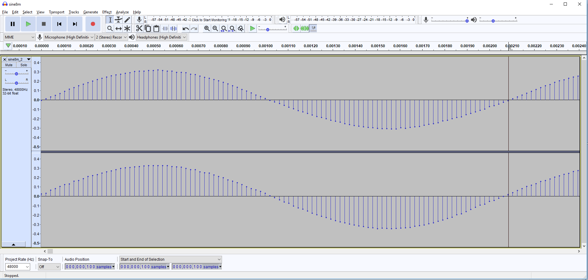
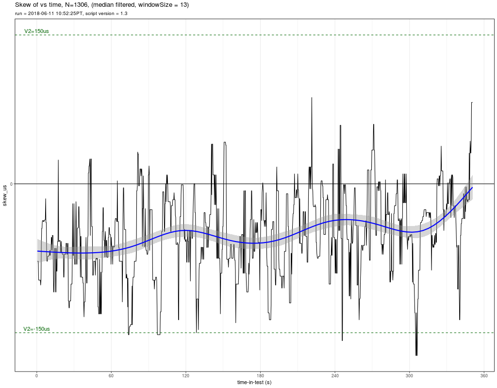

# MRM PreQual Test for i.MX8M

Test results for the MRM Pre Qualification Test for i.MX8M

---

## TEST 1: AUDIO PIPELINE DRIFT

### Results

Observing a 1 cycle of the sine wave we can see there is exactly 100 samples per period

However in a more significant t = 10s, the drifting is now visible.

Doing the calculations with: S1=0, S2=480007, T1=0s, T2=10.00015s

    wavFileFrequency = 480
    sampleRate = 48000
    samplesPerPeriod = sampleRate / wavFileFrequency = 100
    error_samples = (480007 - 0) - 100 * round((480007 - 0)/100) = 7
    deltaT = T2-T1 = 10.00015 - 0 = 10.00015s
    error_PPM = 1.0E6 * (7 / 48000) / 10.00015 = 14.58

**ERROR PPM** = 14.58 PPM which is < 20 PPM, so

**TEST is PASSED**

---

## TEST 2: HIGH-RESOLUTION TIMER

### Results

**Test PASSED** from observing console output

### Sample Output Evidence

    root@imx8mqevk:~/mrm_prequaltest# ./preQualTest --gtest_filter="HRT.*"
    sh: line 0: echo: write error: Device or resource busy
    PreQualification for device: 'Freescale i.MX8MQ EVK', IPaddr: 192.168.1.111, run: 2018-06-07T19:26:28Z

    Note: Google Test filter = HRT.*
    [==========] Running 2 tests from 1 test case.
    [----------] Global test environment set-up.
    [----------] 2 tests from HRT
    [ RUN      ] HRT.SlowAccessTest
    Ensures that HRT increments at about the right rate (~1E9 ns/sec)

    HRT1_ns,HRT2_ns,delta_ns,result
    288824369964,289824443284,1000073320,PASS
    289824476524,290824554284,1000077760,PASS
    290824584044,291824657604,1000073560,PASS
    291824687604,292824767165,1000079561,PASS
    292824800645,293824867965,1000067320,PASS
    293824901805,294824972365,1000070560,PASS
    294825002125,295825072565,1000070440,PASS
    295825104245,296825172166,1000067921,PASS
    296825204206,297825271766,1000067560,PASS
    297825302006,298825428006,1000126000,PASS
    298825460046,299825593246,1000133200,PASS
    299825624926,300825695607,1000070681,PASS
    300825725487,301825793047,1000067560,PASS
    301825824847,302825902007,1000077160,PASS
    302825934407,303826004607,1000070200,PASS
    303826036647,304826113807,1000077160,PASS
    304826145727,305826213048,1000067321,PASS
    305826247008,306826323448,1000076440,PASS
    306826353448,307826479808,1000126360,PASS
    307826511368,308826644808,1000133440,PASS
    308826674928,309826742609,1000067681,PASS
    309826772609,310826844609,1000072000,PASS
    310826877849,311826954649,1000076800,PASS
    311826984529,312827061569,1000077040,PASS
    312827091329,313827158530,1000067201,PASS
    [       OK ] HRT.SlowAccessTest (25003 ms)
    [ RUN      ] HRT.FastAccessTest
    Ensures that the HRT can be accessed quickly (<=3us, 1 failure allowed)

    HRT1_ns,HRT2_ns,delta_ns,result
    313827290890,313827291010,120,PASS
    313827301690,313827301810,120,PASS
    313827309730,313827309850,120,PASS
    313827319570,313827319690,120,PASS
    313827329410,313827329530,120,PASS
    313827337330,313827337450,120,PASS
    313827347050,313827347170,120,PASS
    313827355090,313827355210,120,PASS
    313827364810,313827364930,120,PASS
    313827372730,313827372850,120,PASS
    313827382570,313827382690,120,PASS
    313827390970,313827391090,120,PASS
    313827398890,313827399010,120,PASS
    313827408610,313827408730,120,PASS
    313827416770,313827416890,120,PASS
    313827426850,313827426970,120,PASS
    313827434770,313827434890,120,PASS
    313827444730,313827444850,120,PASS
    313827452770,313827452890,120,PASS
    313827462970,313827462970,0,PASS
    313827473050,313827473170,120,PASS
    313827480970,313827481090,120,PASS
    313827491050,313827491170,120,PASS
    313827498970,313827499090,120,PASS
    313827508930,313827509050,120,PASS
    [       OK ] HRT.FastAccessTest (0 ms)
    [----------] 2 tests from HRT (25003 ms total)

    [----------] Global test environment tear-down
    [==========] 2 tests from 1 test case ran. (25003 ms total)
    [  PASSED  ] 2 tests.
    root@imx8mqevk:~/mrm_prequaltest#

---

## TEST 3: GPIO VALIDATION

### Results

**Test PASSED** by observing Logic Analyzers graphics the width of slow pulses are = 1s, while small pulses are 0.32us (< 1us)

### Sample Output

    root@imx8mqevk:~/mrm_prequaltest# ./preQualTest --gtest_filter="GPIO.*"
    PreQualification for device: 'Freescale i.MX8MQ EVK', IPaddr: 192.168.1.111, run: 2018-04-27T18:56:06Z

    Note: Google Test filter = GPIO.*
    [==========] Running 2 tests from 1 test case.
    [----------] Global test environment set-up.
    [----------] 2 tests from GPIO
    [ RUN      ] GPIO.SlowAccessTest
    Ensures that GPIO can be toggled

    Start recording on the logic analyzer.
    GPIO high
    GPIO low
    GPIO high
    GPIO low
    GPIO high
    GPIO low
    GPIO high
    GPIO low
    GPIO high
    GPIO low
    Stop recording on the logic analyzer.
    [       OK ] GPIO.SlowAccessTest (10006 ms)
    [ RUN      ] GPIO.FastAccessTest
    Ensures that the GPIO can be toggled quickly (<1us)

    Start recording on the logic analyzer.
    GPIO transitioning 20 times.
    Stop recording on the logic analyzer.

    TODO: Manually check the logic analyzer output.
          Slow pulses should have H/L time of ~1s.
          Fast pulses should have H/L time of <1us.
          Duration of fast pulse section should be <20us.
    [       OK ] GPIO.FastAccessTest (0 ms)
    [----------] 2 tests from GPIO (10006 ms total)

    [----------] Global test environment tear-down
    [==========] 2 tests from 1 test case ran. (10007 ms total)
    [  PASSED  ] 2 tests.

---

## TEST4: TIME SYNCHRONIZATION

### Results

**Test PASSED** from graphics obtained from Logic Analyzer([TimeSync8m.test.csv](TimeSync8m.test.csv)) it can be observed that The TP95 is around **86us** of the median (TP50) line.
(Application note marked as PASSED if within 150us)

---

## TEST 5: AUDIO PLACEMENT

### Results Using DMIX Alsa Device

#### Sample Output from RScript results

**Test PASSED** by inspecting [report_i.MX8M.txt](testresults/i.MX8M_20180608T211414Z/report_i.MX8M.txt) file

    +-----------------------------------------------------+
    | AUDIO PLACEMENT FOR i.MX8M                          |
    | run = 2018-06-08 21:17:37 UTC, script version = 1.5 |
    +-----------------------------------------------------+
    N (number of samples) = 118

    TP0 (min)    = 11937 µs = TP50 - 42 µs
    TP2.5        = 11958 µs = TP50 - 21 µs
    TP50         = 11979 µs
    TP97.5       = 11981 µs = TP50 + 2 µs
    TP100 (max)  = 12000 µs = TP50 + 21 µs

    NOTE: always manually check the audio file, too.

    +-------------------------------------+
    | Level 1 KPI compliance (Multi-room) |
    +-------------------------------------+
    KPI1a (TP95 spread  < 5000µs) = 23µs: PASS
    KPI1b (TP100 spread < 5000µs) = 63µs: PASS
         Samples outside V1 TP100 KPI: 0 out of 118 = ~0%

    +------------------------------------+
    | Level 2 KPI compliance (LR Stereo) |
    +------------------------------------+
    KPI2a (TP95 spread  < 150µs)= 23µs: PASS
    KPI2b (TP100 spread < 150µs) = 63µs: PASS
         Samples outside V2 TP100 KPI: 0 out of 118 = ~0%

    +----------------------+
    | Audio Placement Data |
    +----------------------+

    Assume constant (correctable) lag is TP50(lag_µs): 11979 µs

    	 sn burstStartSN lag_µsec uncorrected_lag_µsec V1_KPI V2_KPI
    1    251627       300202    11979                    0      .      .
    2    324343       372918    11979                    0      .      .
    3    400353       448928    11979                    0      .      .
    4    472888       521463    11979                    0      .      .
    5    546041       594616    11979                    0      .      .
    6    617037       665612    11979                    0      .      .
    7    687891       736466    11979                    0      .      .
    8    762012       810587    11979                    0      .      .
    9    832807       881382    11979                    0      .      .
    10   907532       956107    11979                    0      .      .
    11   981574      1030148    11958                  -21      .      .
    12  1056995      1105569    11958                  -21      .      .
    13  1130305      1178879    11958                  -21      .      .
    14  1203563      1252137    11958                  -21      .      .
    15  1276595      1325171    12000                   21      .      .
    16  1347357      1395931    11958                  -21      .      .
    17  1422426      1471000    11958                  -21      .      .
    18  1501877      1550451    11958                  -21      .      .
    19  1574115      1622690    11979                    0      .      .
    20  1644665      1693240    11979                    0      .      .
    21  1727401      1775975    11958                  -21      .      .
    22  1806930      1855505    11979                    0      .      .
    23  1884617      1933192    11979                    0      .      .
    24  1962074      2010649    11979                    0      .      .
    25  2045316      2093891    11979                    0      .      .
    26  2118161      2166736    11979                    0      .      .
    27  2190018      2238593    11979                    0      .      .
    28  2260965      2309540    11979                    0      .      .
    29  2341414      2389989    11979                    0      .      .
    30  2420703      2469278    11979                    0      .      .
    31  2503546      2552121    11979                    0      .      .
    32  2579521      2628096    11979                    0      .      .
    33  2661466      2710040    11958                  -21      .      .
    34  2813968      2862543    11979                    0      .      .
    35  2884494      2933068    11958                  -21      .      .
    36  2959527      3008102    11979                    0      .      .
    37  3038752      3087326    11958                  -21      .      .
    38  3113220      3161795    11979                    0      .      .
    39  3188928      3237503    11979                    0      .      .
    40  3272873      3321448    11979                    0      .      .
    41  3351203      3399777    11958                  -21      .      .
    42  3432223      3480797    11958                  -21      .      .
    43  3504857      3553433    12000                   21      .      .
    44  3586441      3635016    11979                    0      .      .
    45  3670377      3718951    11958                  -21      .      .
    46  3815794      3864369    11979                    0      .      .
    47  3894737      3943312    11979                    0      .      .
    48  3970067      4018642    11979                    0      .      .
    49  4042704      4091278    11958                  -21      .      .
    50  4119703      4168276    11937                  -42      .      .
    51  4190165      4238739    11958                  -21      .      .
    52  4270336      4318911    11979                    0      .      .
    53  4354698      4403271    11937                  -42      .      .
    54  4438344      4486919    11979                    0      .      .
    55  4521213      4569788    11979                    0      .      .
    56  4592943      4641517    11958                  -21      .      .
    57  4677534      4726109    11979                    0      .      .
    58  4756278      4804854    12000                   21      .      .
    59  4837170      4885745    11979                    0      .      .
    60  4919964      4968538    11958                  -21      .      .
    61  4990495      5039069    11958                  -21      .      .
    62  5068746      5117320    11958                  -21      .      .
    63  5141187      5189762    11979                    0      .      .
    64  5219882      5268456    11958                  -21      .      .
    65  5298641      5347216    11979                    0      .      .
    66  5449237      5497811    11958                  -21      .      .
    67  5532278      5580853    11979                    0      .      .
    68  5615271      5663846    11979                    0      .      .
    69  5688002      5736577    11979                    0      .      .
    70  5764906      5813481    11979                    0      .      .
    71  5844403      5892977    11958                  -21      .      .
    72  5919699      5968274    11979                    0      .      .
    73  5993681      6042256    11979                    0      .      .
    74  6072554      6121128    11958                  -21      .      .
    75  6151144      6199719    11979                    0      .      .
    76  6227115      6275689    11958                  -21      .      .
    77  6300362      6348936    11958                  -21      .      .
    78  6384293      6432868    11979                    0      .      .
    79  6462623      6511198    11979                    0      .      .
    80  6542892      6591467    11979                    0      .      .
    81  6627020      6675595    11979                    0      .      .
    82  6701189      6749764    11979                    0      .      .
    83  6781304      6829879    11979                    0      .      .
    84  6864604      6913178    11958                  -21      .      .
    85  6937019      6985594    11979                    0      .      .
    86  7018771      7067345    11958                  -21      .      .
    87  7102232      7150807    11979                    0      .      .
    88  7183292      7231867    11979                    0      .      .
    89  7261408      7309983    11979                    0      .      .
    90  7342933      7391507    11958                  -21      .      .
    91  7424347      7472922    11979                    0      .      .
    92  7496151      7544726    11979                    0      .      .
    93  7580140      7628715    11979                    0      .      .
    94  7655601      7704176    11979                    0      .      .
    95  7735970      7784545    11979                    0      .      .
    96  7812782      7861356    11958                  -21      .      .
    97  7891595      7940170    11979                    0      .      .
    98  7970420      8018995    11979                    0      .      .
    99  8045614      8094188    11958                  -21      .      .
    100 8127151      8175726    11979                    0      .      .
    101 8198531      8247106    11979                    0      .      .
    102 8268524      8317098    11958                  -21      .      .
    103 8340823      8389398    11979                    0      .      .
    104 8415935      8464510    11979                    0      .      .
    105 8494880      8543454    11958                  -21      .      .
    106 8575488      8624062    11958                  -21      .      .
    107 8656487      8705062    11979                    0      .      .
    108 8738555      8787129    11958                  -21      .      .
    109 8818601      8867175    11958                  -21      .      .
    110 8893531      8942105    11958                  -21      .      .
    111 8971315      9019890    11979                    0      .      .
    112 9050854      9099429    11979                    0      .      .
    113 9129801      9178375    11958                  -21      .      .
    114 9203171      9251746    11979                    0      .      .
    115 9281492      9330067    11979                    0      .      .
    116 9362790      9411365    11979                    0      .      .
    117 9433392      9481967    11979                    0      .      .
    118 9510467      9559042    11979                    0      .      .

#### Graphics

---

## TEST 6: AUDIO DISTRIBUTION

### Results

**Test PASSED** from observing console output 

### Sample Output Evidence

**Master**

    root@imx8mqevk:~/Alexa_SDK/mrm_prequaltest#
    stribution.Master 192.168.1.116prequaltest# ./preQualTest --gtest_filter=AudioDis
    sh: line 0: echo: write error: Device or resource busy
    PreQualification for device: 'Freescale i.MX8MQ EVK', IPaddr: 192.168.1.115, run: 2018-04-27T18:09:21Z
    
    Note: Google Test filter = AudioDistribution.Master
    [==========] Running 1 test from 1 test case.
    [----------] Global test environment set-up.
    [----------] 1 test from AudioDistribution
    [ RUN      ] AudioDistribution.Master
    Audio Distribution Unicast MASTER
    Slave devices:
    Slave #0: 192.168.1.116
    Trying to connect to Slave #0 at '192.168.1.116'...CONNECTED.
    master: now connected to 192.168.1.116 on port 1234....
    DONE.
    [       OK ] AudioDistribution.Master (6041 ms)
    [----------] 1 test from AudioDistribution (6042 ms total)
    
    [----------] Global test environment tear-down
    [==========] 1 test from 1 test case ran. (6042 ms total)
    [  PASSED  ] 1 test.

    

**Slave**

    root@imx8mqevk:~/mrm_prequaltest#
    .Slavemx8mqevk:~/mrm_prequaltest# ./preQualTest --gtest_filter=AudioDistribution.
    sh: line 0: echo: write error: Device or resource busy
    PreQualification for device: 'Freescale i.MX8MQ EVK', IPaddr: 192.168.1.116, run: 2018-04-27T18:08:53Z
    
    Note: Google Test filter = AudioDistribution.Slave
    [==========] Running 1 test from 1 test case.
    [----------] Global test environment set-up.
    [----------] 1 test from AudioDistribution
    [ RUN      ] AudioDistribution.Slave
    Audio Distribution Unicast: SLAVE
    slave: waiting for connections...
    slave: got connection from 192.168.1.115
    Each report below = ~1000000 bytes received.
    incrMbps,cumuMbps
    12.399,12.399,12.399
    12.649,12.523,12.523
    12.658,12.568,12.568
    12.682,12.596,12.596
    12.539,12.585,12.585
    12.697,12.603,12.603
    12.076,12.525,12.525
    16.280,12.896,12.896
    18.375,13.339,13.339
    17.570,13.668,13.668
    slave: recv -- Master disconnected
    [       OK ] AudioDistribution.Slave (9701 ms)
    [----------] 1 test from AudioDistribution (9701 ms total)
    
    [----------] Global test environment tear-down
    [==========] 1 test from 1 test case ran. (9701 ms total)
    [  PASSED  ] 1 test.
    root@imx8mqevk:~/mrm_prequaltest#

---
